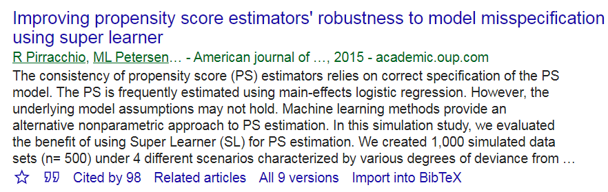

```{r setup, include=FALSE}
knitr::opts_chunk$set(echo = FALSE)
options("kableExtra.html.bsTable" = TRUE)
require(knitr)
require(kableExtra)
require(tableone)
require(MatchIt)
require(Matching)
require(optmatch)
require(Publish)
require(SASxport)
require(DiagrammeR)
require(DiagrammeRsvg)
require(rsvg)
library(magrittr)
library(svglite)
library(png)
require(cobalt)
```

\newcommand{\indep}{\perp \!\!\! \perp}

## About this event

- [TI Methods Speaker Series page](https://www.ti.ubc.ca/2020/08/06/sep-30-ti-methods-speaker-series-a-practical-introduction-to-propensity-score-analysis-using-r/): Therapeutics Initiative
    - Dr. Carole Lunny

- [SARGC page](https://ssc.ca/en/students-and-recent-graduates-committee-0): Students and Recent Graduates Committee (SARGC) coordinate activities for the Statistical Society of Canada (SSC)'s student and recent graduate members
    - Md. Erfanul Hoque
    - Janie Coulombe

## Outline

- [1] Data and Regression 
  - (Diagnostics)
- [2] Exact matching 
  - (motivation)
- [3] Propensity score matching 
  - (4 steps)
- [4] Propensity score Reviews in different disease areas 
  - (brief)

## [1] Right Heart Catheterization (RHC) Dataset 

The dataset that we will use today is from Connors et al. (1996).

```{r  out.width = "40%", fig.show = "hold", cache=TRUE}
 

 
```

### Notations

- Outcome `Death` ($Y$)
  - Death at any time up to 180 Days
- Treatment `swang1`  ($A$: Swan-Ganz catheter)
  - Whether or not a patient received a RHC
- Covariate list: $L$ (`age`, `sex`, `race` , $\ldots$)
- Analysis strategy: matching RHC patients with non-RHC patients


## [1] Right Heart Catheterization (RHC) Dataset 

- `RHC` is helpful in guiding therapy decision
  - Helps determine the pressures within the heart
- Popularly beleived that `RHC` is benefitial
- Conducting RCT is hard (ethical reasons)
- Benefit of `RHC` was not shown earlier (1996)
- SUPPORT data has 2 phases
  - phase 1: prospective observational study
  - phase 2: cluster RCT
  - Data in this study is combined
  
```{r  out.width = "20%", cache=TRUE}
include_graphics("images/RHC.png") 
```

## [1] Load data


```{r load, cache=TRUE, echo = TRUE}
# Load the cleaned up data. 
# Reproducible codes:
# https://ehsanx.github.io/SARGC-TIMethods/ 
analytic.data <- readRDS("data/RHC.Rds")
# Data size and number of variables 
dim(analytic.data)
# variable names
names(analytic.data)
```

## [1] Inspecting data: Crude

```{r tab0, cache=TRUE, echo = TRUE}
require(tableone)
# 2 x 2 table
tab0 <- CreateTableOne(vars = "RHC",
               data = analytic.data, 
               strata = "Death")
print(tab0, showAllLevels = TRUE)
```

## [1] Inspecting data: Some baseline variables

```{r tab1, cache=TRUE, echo = TRUE}
baselinevars <- c("age","sex", "race")
# Table 1
tab1 <- CreateTableOne(vars = baselinevars,
               data = analytic.data, 
               strata = "Death", includeNA = TRUE, 
               test = TRUE, smd = FALSE)
print(tab1, showAllLevels = FALSE, smd = FALSE)
```

## [1] Crude regression

```{r reg1, cache=TRUE, echo = TRUE}
# adjust the exposure variable (primary interest)
fit0 <- glm(I(Death=="Yes")~RHC,
            family=binomial, data = analytic.data)
require(Publish)
publish(fit0)
```

## [1] Adjusted regression

```{r reg2, cache=TRUE, echo = TRUE}
# adjust the exposure variable + demographics
fit1 <- glm(I(Death=="Yes")~RHC + age + sex + race,
            family=binomial, data = analytic.data)
publish(fit1)
```

## [1] Why adjust?

### Continuous outcome ($Y$)

- treated group $A=1$ (`RHC`)
- control group $A=0$ (`no RHC`)

Treatment effect = $E[Y|A=1]$ vs. $E[Y|A=0]$

- Would only work if 2 groups are comparable / exchangeable / ignorable treatment assignment
- Randomization with enough sample size is one 

### Binary outcome ($Y$)

Treatment effect = $prob[Y = 1|A=1]$ vs. $prob[Y=1|A=0]$

## [1] Why adjust?

In absence of randomization, 

$E[Y|A=1] - E[Y|A=0]$

includes

- Treatment effect
- Systematic differences in 2 groups (‘confounding’)
  - Doctors may prescribe tx more to frail and older age patients. 
  - In here, $L$ = age is a confounder.

## [1] Why adjust?

In absence of randomization, if age is a known issue

### Causal effect for young

- $E[Y|A=1, L =$ `younger age`$]$ - $E[Y|A=0, L =$ `younger age`$]$

### Causal effect for old

- $E[Y|A=1, L =$ `older age`$]$ - $E[Y|A=0, L =$ `older age`$]$

Conditional exchangeability; only works if $L$ is measured

## [1] Why adjust?

```{r graph1ttt, echo=FALSE, cache=TRUE, eval = TRUE}
g2 <- grViz("
	digraph causal {
	
	  # Nodes
    node [shape = box]
    # node [shape = circle]
    A [label = 'RHC']
    Y [label = 'Death']
    L1 [label = 'Sex']
    L2 [label = 'Race']
    L3 [label = 'Age']
    L4 [label = 'Heart rate']

	  # Edges
	  edge [color = black,
	        arrowhead = vee]
	  rankdir = LR
    A -> Y
    {L1 L2 L3 L4} -> {A Y}

	  # Graph
	  graph [overlap = true, fontsize = 10]
	}")
g2 %>% export_svg %>% charToRaw %>% rsvg %>% png::writePNG("images/dag1.png")
```

```{r graph1xttt, echo=FALSE, out.width = '50%'}

```

THis was not a completely randomized data; some observational data was combined.

## [1] Adjusted regression (v2)

```{r reg3, cache=TRUE, echo = TRUE}
# adjust the exposure variable + adjustment variables
baselinevars <- c("age","sex", "race","Disease.category", 
                  "DNR.status", "APACHE.III.score",
                  "Pr.2mo.survival","No.of.comorbidity",
                  "DASI.2wk.prior","Temperature",
                  "Heart.rate", "Blood.pressure",
                  "Respiratory.rate", "WBC.count",
                  "PaO2.by.FIO2","PaCO2","pH",
                  "Creatinine","Albumin","GComa.Score")
out.formula <- as.formula(paste("I(Death=='Yes')", "~", 
                               paste(baselinevars, 
                                     collapse = "+")))
out.formula
```

## [1] Adjusted regression (v2)

```{r reg3b, cache=TRUE, echo = TRUE}
fit2 <- glm(out.formula,
            family=binomial, data = analytic.data)
publish(fit2) 
```
## [1] Adjusted regression (v2)

```{r reg3bc1, out.width = "50%", cache=TRUE, echo = TRUE}
plot(fit2, which =1)
```

- curvilinear trends?
  - logistic regression IS curvilinear by nature
  
## [1] Adjusted regression (v2)

```{r reg3bc3, out.width = "50%", cache=TRUE, echo = TRUE}
plot(fit2, which =3)
```

- red line is approximately horizontal?
- points have approximately equal spread around the red line? 
  - more about detecting heteroscedasticity?
  
## [1] Adjusted regression (v2)

```{r reg3bc3jr, out.width = "50%", cache=TRUE, echo = TRUE}
plot(fit2, which =4)
```

-  Cook's D estimates the influence of data points

## [2] Alternate to Regression


How sure are you about the model-specification? 

- Interaction?
- Polynomial?

- Potential solution?
  - Exact Matching

## [2] Exact Matching: 2 variables

```{r combin, cache=TRUE, echo = TRUE}
var.comb <- do.call('paste0', 
                    analytic.data[, c('race', 'sex')])
length(table(var.comb))
table(var.comb)
table(analytic.data$RHC,var.comb)
```

## [2] Exact Matching: 2 variables

```{r match0, cache=TRUE, echo = TRUE}
require(MatchIt)
# exact match by sex and race
m.out = matchit (RHC=="RHC" ~ sex + race,
                 data = analytic.data, 
                 method = "exact") 
m.out$nn
```

## [2] Exact Matching: 3 variables

```{r combin2, cache=TRUE, echo = TRUE}
var.comb <- do.call('paste0', 
                    analytic.data[, c('race', 'sex', 'age')])
length(table(var.comb))
table(analytic.data$RHC,var.comb=="otherMale[80, Inf)")
table(analytic.data$RHC,var.comb=="otherFemale[80, Inf)")
```

## [2] Exact Matching: 3 variables

```{r match1, cache=TRUE, echo = TRUE}
# exact match by age, sex and race
m.out = matchit (RHC=="RHC" ~ age + sex + race,
                 data = analytic.data, 
                 method = "exact") 
m.out$nn
```

## [2] Exact Matching: 3 variables

```{r match1a, cache=TRUE, echo = TRUE}
matched.data <- match.data(m.out)
dim(matched.data)
nrow(analytic.data)-nrow(matched.data) # subjects deleted
# Not taking into account of matched sets
fit1m <- glm(I(Death=="Yes")~RHC, 
            family=binomial, data = matched.data)
publish(fit1m)
```

## [2] Exact Matching: many categorical variables

```{r match2, cache=TRUE, echo = TRUE}
m.out = matchit (RHC=="RHC" ~ age + sex + race + 
                   Disease.category + DNR.status,
                 data = analytic.data, 
                 method = "exact") 
m.out$nn
```

## [2] Exact Matching: many categorical variables

```{r match2a, cache=TRUE, echo = TRUE}
matched.data <- match.data(m.out)
dim(matched.data)
fit2m <- glm(I(Death=="Yes")~RHC,
            family=binomial, data = matched.data)
publish(fit2m)
```

## [2] Exact Matching: including a continuous variable

```{r match3, cache=TRUE, echo = TRUE}
m.out = matchit (RHC=="RHC" ~ age + sex + race + 
                   Disease.category + DNR.status+ 
                   Heart.rate, # continuous
                 data = analytic.data, 
                 method = "exact") 
m.out$nn
```

## [2] Exact Matching: including more continuous variables

```{r match4, cache=TRUE, echo = TRUE}
m.out = matchit (RHC=="RHC" ~ age + sex + race + 
                   Disease.category + DNR.status+ 
                   Heart.rate + Blood.pressure + 
                   Temperature, 
                 data = analytic.data, 
                 method = "exact") 
m.out$nn
```

## [2] Exact Matching: including more continuous variables

```{r match4a, cache=TRUE, echo = TRUE}
matched.data <- match.data(m.out)
dim(matched.data)
nrow(analytic.data)-nrow(matched.data) # subjects deleted
fit3m <- glm(I(Death=="Yes")~RHC,
            family=binomial, data = matched.data)
publish(fit3m)
```

## [3] Propensity Score 

### Defining Propensity score (PS)

  - Conditional Probability of getting treatment, given the observed covariates
  - Prob(treatment: `A` = 1 | baseline or pre-treatment covariates: `L`)
      - Prob(`RHC` = treated/RHC group | `age`, `sex`, `race`, etc.)
      - f(L) = Prob(A=1|L)

```{r ps, cache=TRUE, echo = TRUE}
baselinevars
```

## [3] Propensity Score 

```{r  out.width = "50%", cache=TRUE}
 
```

### Theoretical result

**Rosenbaum, Rubin (1983)** showed: 

- For potential outcomes $(Y^0, Y^1)$, if you have sufficient observed covariate list $L$ to reduce confounding (`strong ignoribility'):  $A$ being treatment assignment here: 
  - i.e., if $(Y^0, Y^1) \indep A | L$ (Note that is this NOT $Y \indep A | L$)

- then
  - $(Y^0, Y^1) \indep A | PS$ and 
  - $A \indep L | PS$

## [3] Propensity Score 

### Assumptions

- no unmeasured confounding
- positivity ($ 0 < PS < 1 $)
- well-defined treatment
- sufficient overlap
- model-specification

## [3] Propensity Score 

```{r  out.width = "50%", fig.show = "hold", cache=TRUE}
 

 
```

- Observed covariates are used to fix design
- Which covariates should be selected:
  - known to be a confounder (causes of `Death` and `RHC`)
  - known to be a cause of the outcome (risk factors of `Death`)
  - avoid known instruments or noise variables: **SE suffers**
  - mediating factors should be avoided (total effect = goal) 

- Stepwise (p-value or criterion based) not recommended
  - depending on sample size, different values can get selected
  - may select variables highly associated with $A$
- Don't look at the outcome (`Death`) in your data to select covariates

## [3] Propensity Score

Many ways to use propensity scores (PS) in the analysis

- **PS matching** [our focus today]
- PS weighting
- PS stratification
- PS used as a covariate

## [3] Propensity Score Matching

```{r  out.width = "50%", cache=TRUE}
 
```

### Propensity score matching has 4 steps

- Stage 1: exposure modelling: $PS = Prob(A=1|L)$
- Stage 2: Match by $PS$
- Stage 2: Assess balance and overlap ($PS$ and $L$)
- phase 4: outcome modelling: $Prob(Y=1|A=1)$


## [3] Propensity Score Matching

```{r  out.width = "50%", cache=TRUE}
 
```

- Assessment of Balance in the whole data 
  - balance = similarity of the covariate distributions
  - $d$ or $SMD > 0.1$ can be considered as imbalance

```{r  out.width = "20%", cache=TRUE}
 
```
```{r  out.width = "40%", cache=TRUE}
 
```

```{r ps1g, cache=TRUE, echo = TRUE}
tab1e <- CreateTableOne(vars = baselinevars,
               data = analytic.data, strata = "RHC", 
               includeNA = TRUE, 
               test = FALSE, smd = TRUE)
```


## [3] Propensity Score Matching
```{r ps1gres, cache=TRUE, echo = TRUE}
print(tab1e, smd = TRUE)
```

## [3] Propensity Score Matching

### Step 1: PS estimation

Specify the propensity score model to estimate propensity scores, and fit the model

```{r ps1, cache=TRUE, echo = TRUE}
ps.formula <- as.formula(paste("I(RHC == 'RHC')", "~", 
                paste(baselinevars, collapse = "+")))
ps.formula
```
- Coef of PS model fit is not of concern 
- Model can be rich: to the extent that prediction is better
- But look for multi-collinearity issues
  - SE too high?


## [3] Propensity score Matching

While PS has balancing property, PS is unknown and needs to be estimated:

```{r ps1vd, cache=TRUE, echo = TRUE}
# fit logistic regression to estimate propensity scores
PS.fit <- glm(ps.formula,family="binomial", 
              data=analytic.data)
# extract estimated propensity scores from the fit
analytic.data$PS <- predict(PS.fit, 
                            newdata = analytic.data, type="response")
```

- Other machine learning alternatives are possible to use instead of logistic regression.
  - tree based methods have better ability to detect non-linearity / non-additivity (model-specification aspect)
  - shrinkage methods - lasso / elastic net may better deal with multi-collinearity
  - ensemble learners / super learners were successfully used
  - shallow/deep learning!

## [3] Propensity score Matching

- Don't loose sight that better *balance* is the ultimate goal for propensity score
- Prediction of $A$ is just a means to that end (as true PS is unknown).
- May attract variables highly associated with $A$

```{r  out.width = "50%", fig.show = "hold", cache=TRUE}
 


```

## [3] Propensity score Matching

### Step 1
```{r ps2, cache=TRUE, echo = TRUE}
# summarize propensity scores
summary(analytic.data$PS)
# summarize propensity scores by exposure group
tapply(analytic.data$PS, analytic.data$RHC, summary)
```

## [3] Propensity Score Matching

### Step 2: PS matching

```{r ps5, cache=TRUE, echo = TRUE}
logitPS <-  -log(1/analytic.data$PS - 1) 
# logit of the propensity score
.2*sd(logitPS) # suggested in the literature
0.1*sd(logitPS) # we are using this
# choosing too strict PS has unintended consequences 
```
```{r  out.width = "50%", fig.show = "hold", cache=TRUE}
 

 
```


## [3] Propensity Score Matching

### Step 2

Match using estimates propensity scores

- nearest-neighbor (NN) matching
- without replacement
- with caliper = .1*SD of logit of propensity score
- with 1:1 ratio (pair-matching)

```{r  out.width = "30%", cache=TRUE}
# Image from Wiki
 
```

## [3] Propensity Score Matching

### Step 2

Match using estimates propensity scores

```{r ps6, cache=TRUE, echo = TRUE}
set.seed(123)
match.obj <- matchit(ps.formula, data = analytic.data,
                     distance = analytic.data$PS, 
                     method = "nearest", replace=FALSE,
                     caliper = .1*sd(logitPS), ratio = 1)
# see matchit function options here
# https://www.rdocumentation.org/packages/MatchIt/versions/1.0-1/topics/matchit
analytic.data$PS <- match.obj$distance
summary(match.obj$distance)
```

## [3] Propensity Score Matching

### Step 2

```{r ps7b, cache=TRUE, echo = TRUE}
match.obj$nn
```

## [3] Propensity Score Matching

### Step 2

Step 1 and 2 can be done together by specifying `distance`

```{r ps7, cache=TRUE, echo = TRUE}
match.obj <- matchit(ps.formula, data = analytic.data,
                     distance = 'logit', 
                     method = "nearest", 
                     replace=FALSE,
                     caliper = .1*sd(logitPS), 
                     ratio = 1)
analytic.data$PS <- match.obj$distance
summary(match.obj$distance)
```
## [3] Propensity Score Matching

### Step 2: Taking a closer look at the matches

```{r ps3dfg, cache=TRUE, echo = TRUE}
# Ref: https://lists.gking.harvard.edu/pipermail/matchit/2013-October/000559.html
matches <- as.data.frame(match.obj$match.matrix)
colnames(matches)<-c("matched_unit")
matches$matched_unit<-as.numeric(
  as.character(matches$matched_unit))
matches$treated_unit<-as.numeric(rownames(matches))
matches.only<-matches[!is.na(matches$matched_unit),]
head(matches.only)
```

## [3] Propensity Score Matching

### Step 2: Taking a closer look at the matches (1st pair)

```{r ps3cvf, cache=TRUE, echo = TRUE}
analytic.data[analytic.data$ID %in% 
                as.numeric(matches.only[1,]),]
```

## [3] Propensity Score Matching

### Step 2: Taking a closer look at the matches (2nd pair)

```{r ps3cvf2, cache=TRUE, echo = TRUE}
analytic.data[analytic.data$ID %in% 
                as.numeric(matches.only[2,]),]
```


## [3] Propensity score Matching

### Step 3: Assessing balance and overlap 

**Balance is more important than prediction**! 

- Criteria to assess success of step 2: PS estimation
  - better balance
  - better overlap
  - PS = 0 or PS = 1 needs close inspection

```{r ps3, out.width = "30%", cache=TRUE, echo = TRUE}
boxplot(PS ~ RHC=='RHC', data = analytic.data, 
        lwd = 2, ylab = 'PS')
stripchart(PS ~ RHC=='RHC', vertical = TRUE, 
           data = analytic.data, method = "jitter", 
           add = TRUE, pch = 20, col = 'blue')
```

## [3] Propensity Score Matching

### Step 3

Vizualization

```{r ps8, out.width = "50%", cache=TRUE, echo = TRUE}
plot(match.obj, type = "jitter")
```


## [3] Propensity Score Matching

### Step 3

Vizualization for assessing overlap issues

```{r ps9, out.width = "50%", cache=TRUE, echo = TRUE}
plot(match.obj, type = "hist")
```

## [3] Propensity Score Matching

### Step 3

Assessment of Balance

```{r ps10, cache=TRUE, echo = TRUE}
matched.data <- match.data(match.obj)
tab1m <- CreateTableOne(vars = baselinevars,
               data = matched.data, strata = "RHC", 
               includeNA = TRUE, 
               test = TRUE, smd = TRUE)
```

Compare the similarity of baseline characteristics between treated and untreated subjects in a the propensity score-matched sample. 

- In this case, we will compare SMD < 0.1 or not. 
- In some literature, other generous values (0.25) are proposed.

```{r  out.width = "50%", fig.show = "hold", cache=TRUE}
 

 
```

## [3] Propensity Score Matching

### Step 3

```{r ps10a, cache=TRUE, echo = TRUE}
print(tab1m, showAllLevels = FALSE, smd = TRUE, test = FALSE) 
```


## [3] Propensity Score Matching

### Step 3 

Possible to get p-values to check balance: but strongly discouraged

- P-value based balance assessment can be influenced by sample size

```{r  out.width = "50%", fig.show = "hold", cache=TRUE}
 
```

```{r ps10ax, cache=TRUE, echo = TRUE}
print(tab1m, showAllLevels = FALSE, smd = FALSE, test = TRUE) 
```

## [3] Propensity Score Matching

### Step 3

Assessment of balance in the matched data

```{r ps11, cache=TRUE, echo = TRUE}
smd.res <- ExtractSmd(tab1m)
t(round(smd.res,2))
```

## [3] Propensity Score Matching

### Step 3: Variance ratio

- Variance ratios $\sim$ 1 means: 
 - equal variances in groups 
 - group balance
 - could vary from 1/2 to 2
 - other cut-points are suggested as well (0.8 to 1.2)

```{r  out.width = "50%", fig.show = "hold", cache=TRUE}


```

## [3] Propensity Score Matching

### Step 3: Variance ratio

```{r vr, cache=TRUE, echo = TRUE}
require(cobalt)
baltab.res <- bal.tab(x = match.obj, data = analytic.data, 
                      treat = analytic.data$RHC, 
                      disp.v.ratio = TRUE)
baltab.res$Balance$V.Ratio.Adj
```

## [3] Propensity Score Matching

### Step 4: Outcome modelling

- Some flexibility in choosing outcome model 
  - considered independent of exposure modelling
  - some propose double robust approach
  - adjusting imbalanced covariates only?

Estimate the effect of treatment on outcomes using propensity score-matched sample
```{r ps12, cache=TRUE, echo = TRUE}
fit3 <- glm(I(Death=="Yes")~RHC,
            family=binomial, data = matched.data)
publish(fit3)
```

## [3] Propensity Score Matching

### Step 4: Outcome modelling

```{r ps12b, cache=TRUE, echo = TRUE}
out.formula
fit3b <- glm(out.formula,
            family=binomial, data = matched.data)
publish(fit3b)
```


## [3] Propensity Score Matching

### Step 4: Other cosiderations for outcome model

The above analysis do not take matched pair into consideration while regressing. Literature proposes different strategies: 

- do not control for pairs / clusters 
  - use `glm` as is
- control for pairs / clusters
  - use `cluster` option or GEE or conditional logistic
- Bootstrap for matched pairfor WOR
  - may not be appropriate for WR

```{r  out.width = "50%", cache=TRUE}
 
```

## [3] Propensity Score Matching

### Step 4

- The example compared `RHC` (a treated group; target) vs `No RHC` (untreated).
- Thc corresponding treatment effect estimate is known as
  - Average Treatment Effects on the Treated (ATT) 
- Other estimates from PS analysis are possible that compared the whole population
  - what if everyone treated vs. what if nobody was treated (ATE)

## [3] Propensity Score Matching

### Other matching algorithms

- Optimal
- genetic matching
- CEM
- variable ratio NN

## [3] Propensity Score Matching

- MatchIt
- Matching

Other useful packages

- cobalt
- twang

Outdated package

- nonrandom

## [4] Discipline-specific PS Systematic Reviews 

- Propensity score matching most popular
  - Cardiovascular / Infective endocarditis / Intensive care 
  - Critical care / anesthesiology / Sepsis / Psychology
  - Cancer / Multiple sclerosis 
- Not meta-analysis; but reviews of usage of PS methods in different disciplines
```{r  out.width = "30%", fig.show = "hold", cache=TRUE}
 

 

include_graphics("images/r3.png") 

 

 

 

 

 

 
```

## [4] Discipline-specific PS Systematic Reviews 

### Reporting Guideline

- Be specific about population of interest
  - ATT vs. ATE
  - exclusion criteria
- Be specific about exposure
  - no multiple version of treatment
  - no interference
  - comparator
- Report clearly about missing data
  - how handled
- Why PS matching (or other approach) was selected?  
- Software

## [4] Discipline-specific PS Systematic Reviews 

### Reporting Guideline

- How variables selected
- Any important variables not measured
  - proxy
- Model selection
  - interaction or polynomials
  - logistic vs. machine learning
- Overlap vs. balance
  - numeric and visual


```{r  out.width = "30%", cache=TRUE}
 
```

## [4] Discipline-specific PS Systematic Reviews 

### Reporting Guideline

- Reduction % of the matched data
- Residual imbalance
  - refit PS model
- Subgroup analysis
  - Refit within each group for matching
- Sensitivity analysis
  - unmeasured confounder
  - any positivity issue? 
    - ad-hoc methods: truncation / trimming: bias-variance trade-off

```{r  out.width = "50%", cache=TRUE}
 
```

## Further Reading

```{r  out.width = "20%", cache=TRUE}
 
```
```{r  out.width = "50%", cache=TRUE}
 
```

Companion site: [study.sagepub.com/leite](https://study.sagepub.com/leite)

## Thank you!

<center>
<font size="50">[ehsank.com](http://ehsank.com/)</font>
</center>
